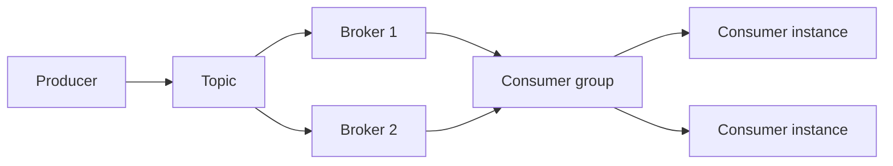
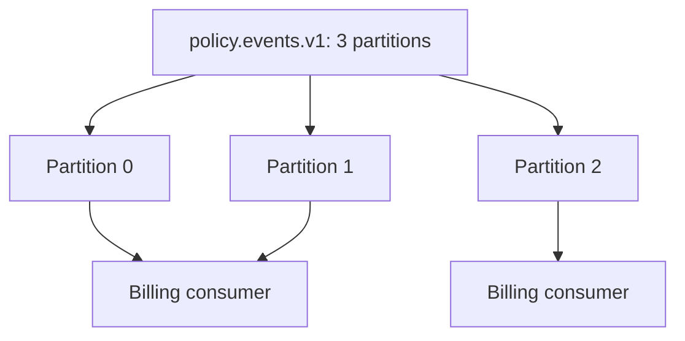
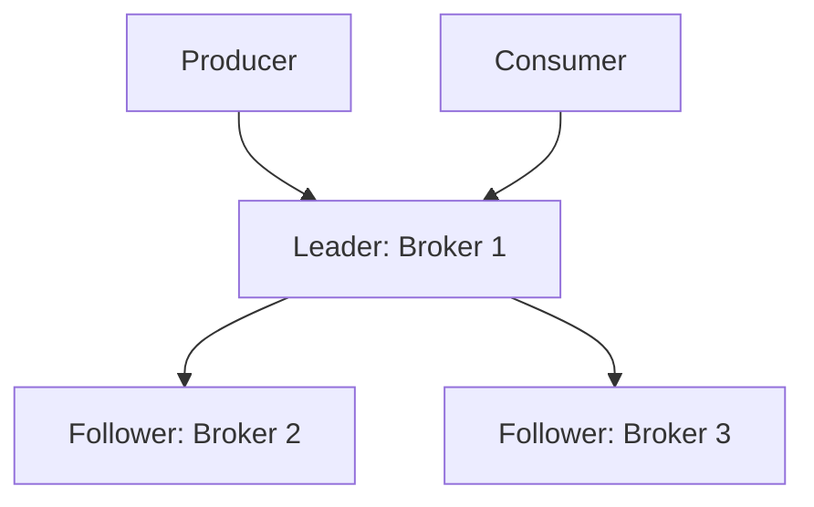
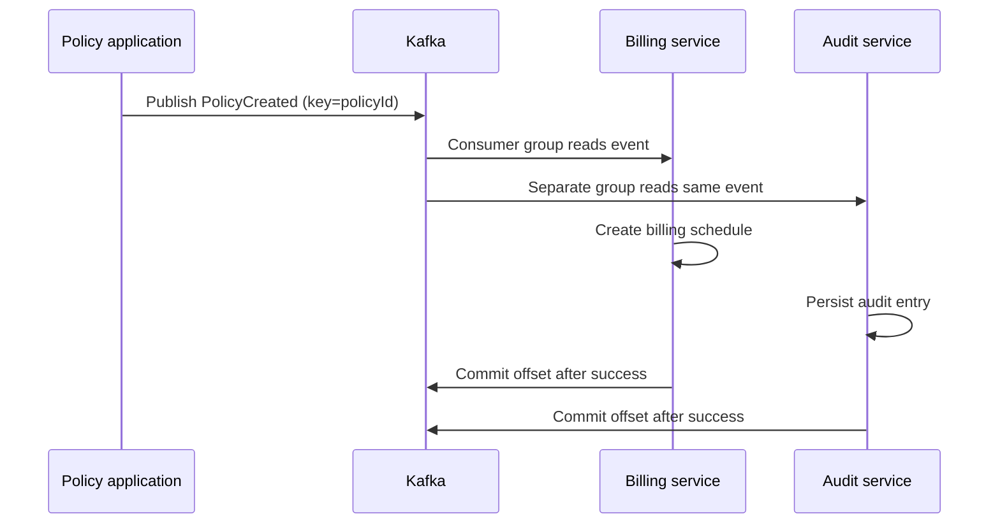

# Kafka — Detailed Notes and Practical Guide

**Date:** 27-Aug-2026  
**Purpose:** Learn Apache Kafka as a distributed event-streaming platform, understand how data moves through it, and operate it safely in a DevOps/application environment.

---

## 1. What Kafka is

Apache Kafka is a distributed platform for publishing, storing, and consuming **events** (also called messages or records). It is designed for continuous data streams at high throughput and is durable: events can be retained and replayed after they have been consumed.

An event normally describes something that happened:

```json
{
  "eventType": "PolicyCreated",
  "policyId": "POL-102938",
  "customerId": "C-88341",
  "occurredAt": "2026-08-27T09:15:26Z"
}
```

Kafka is useful when systems should communicate asynchronously. The policy application can publish this event without waiting for billing, notification, data-warehouse, or audit systems to complete their work.

### Kafka compared with a traditional message queue

| Capability | Traditional queue | Kafka topic |
|---|---|---|
| Primary model | Remove message after a consumer receives it | Append events to an ordered log |
| Retention | Usually until acknowledged | Time/size based; independently configurable |
| Replay | Often difficult or impossible | Consumers can reset their position and replay |
| Consumer model | One receiver per message | Many consumer groups can independently consume the same event |
| Typical use | Task distribution, request/reply | Event streaming, integration, analytics, audit |

Kafka is not automatically the best choice for every synchronous service call. Use REST/gRPC when the caller needs an immediate response. Use Kafka when an event can be handled independently, reliably, and possibly by several downstream systems.

---

## 2. Core architecture



| Component | Role |
|---|---|
| **Producer** | Application that writes events to a topic. |
| **Topic** | Named logical stream, such as `policy.created.v1`. |
| **Partition** | Ordered, append-only subset of a topic. Partitions provide scale and parallelism. |
| **Broker** | Kafka server that stores partitions and serves clients. A cluster has multiple brokers. |
| **Replica** | Additional copy of a partition stored on another broker for resilience. |
| **Consumer** | Application that reads events. |
| **Consumer group** | Consumers cooperating to process a topic. Each partition is assigned to at most one consumer within that group. |
| **Offset** | Sequential position of an event inside one partition. |
| **Controller / KRaft quorum** | Metadata-management layer in modern Kafka deployments. KRaft replaces ZooKeeper in current Kafka architectures. |

### A useful mental model

A topic is like a filing cabinet; partitions are drawers; offsets are numbered folders in each drawer. Ordering is guaranteed **inside one drawer (partition)**, not across every drawer in the cabinet.

---

## 3. Topics, partitions, keys, and ordering

Each record has a topic, partition, offset, timestamp, optional key, headers, and value.

```text
Topic: policy.events.v1
Partition 0: offset 0 → offset 1 → offset 2 → ...
Partition 1: offset 0 → offset 1 → offset 2 → ...
Partition 2: offset 0 → offset 1 → offset 2 → ...
```

### Why a key matters

When a producer sends records with the same key, Kafka hashes the key and normally sends them to the same partition. This preserves the order for that entity.

```text
key = POL-102938
PolicyCreated → PolicyAmended → PolicyCancelled
```

All three events must use `POL-102938` as their key if a consumer must see them in that sequence. A randomly distributed or absent key cannot provide per-policy ordering.

### Partition design rules

- Start from required throughput and consumer parallelism, not just broker count.
- A consumer group cannot process a topic with more active consumers than partitions; extra consumers sit idle.
- Increasing partitions later is possible, but key-to-partition mappings can change. Do not rely on global order.
- Keep event keys stable and meaningful: `policyId`, `claimId`, or `customerId` are common choices.

---

## 4. Producers: reliable publishing

A producer serializes an event, selects a topic/partition, and waits for an acknowledgement according to its configuration.

### Delivery acknowledgement levels

| `acks` value | Meaning | Use case |
|---|---|---|
| `0` | Producer does not wait for a broker response. | Telemetry where loss is acceptable. |
| `1` | Leader broker acknowledges after writing locally. | Lower latency; leader failure can lose acknowledged data. |
| `all` | Leader waits for all in-sync replicas (ISR) required by the topic. | Recommended for important business events. |

For important records, use `acks=all`, retries, and idempotence. Also set `min.insync.replicas` to at least `2` on a replicated production topic; this prevents acknowledgement when only one replica is available.

### Producer pseudocode

```java
ProducerRecord<String, String> record = new ProducerRecord<>(
    "policy.events.v1",
    "POL-102938",                 // key: keeps policy events ordered
    "{\"eventType\":\"PolicyCreated\"}"
);
producer.send(record).get();
```

Typical producer properties:

```properties
acks=all
enable.idempotence=true
retries=2147483647
delivery.timeout.ms=120000
compression.type=zstd
linger.ms=10
batch.size=65536
```

Batching and compression improve throughput. They add a small latency trade-off, so tune them only after measuring actual load.

---

## 5. Consumers, groups, offsets, and rebalancing

Consumers pull records from Kafka. Kafka retains records; a consumer keeps track of which offset it has processed.

### Consumer-group behavior



The two consumers are in the same `billing-service` group. Kafka assigns each partition to only one of them, avoiding duplicate work within that group. A separate `audit-service` group receives the full stream independently.

### Offset commit choices

| Approach | Result | Risk / use |
|---|---|---|
| Auto-commit | Offset is committed periodically. | Simple, but can lose unprocessed work on failure. Avoid for critical processing. |
| Commit after processing | Redelivery can occur after a crash before the commit. | **At-least-once** delivery; common and safe when processing is idempotent. |
| Commit before processing | Event can be skipped if processing fails. | Generally avoid. |
| Kafka transactions + read-committed consumers | Atomic read-process-write within Kafka. | Helps achieve exactly-once processing in Kafka workflows. |

Kafka delivery is normally **at least once**. Build consumers so a duplicate event is harmless. For example, store the event ID in a database with a unique constraint, or make an update naturally idempotent.

### Rebalancing

When a consumer joins, leaves, or fails, Kafka redistributes partitions in the group. During reassignment, processing briefly pauses. Keep processing reasonably fast and avoid long blocking calls in the poll loop, otherwise Kafka can consider a consumer dead and trigger repeated rebalances.

---

## 6. Replication and fault tolerance

For each partition Kafka chooses a leader and follower replicas.



With replication factor 3, a partition has one leader and two replicas on different brokers. If the leader fails, an in-sync follower can become leader.

Recommended baseline for a production cluster spanning three brokers:

```properties
default.replication.factor=3
min.insync.replicas=2
unclean.leader.election.enable=false
auto.create.topics.enable=false
```

`unclean.leader.election.enable=false` is important for business data: it prevents an out-of-sync replica from becoming leader and losing acknowledged records. The trade-off is that an affected partition may be temporarily unavailable until an in-sync replica returns.

---

## 7. KRaft and the metadata quorum

Kafka clusters need a metadata quorum that tracks broker, topic, partition, and access-control metadata. Modern Kafka uses **KRaft** (Kafka Raft) instead of ZooKeeper.

- A small odd number of controllers is typical: 3 or 5.
- A majority must be available. Three controllers need two active nodes.
- Controllers can be dedicated in larger clusters; combined broker/controller nodes are acceptable for small, non-critical environments.
- Back up and protect controller metadata; loss of the quorum is a cluster-level incident.

This has the same key principle as other clustered services: availability depends on quorum, not merely on one server still being reachable.

---

## 8. Retention, compaction, and replay

Kafka does not remove a record just because a consumer read it. Topic settings determine how long it stays.

| Policy | What Kafka retains | Good use |
|---|---|---|
| Time/size retention | Every event until `retention.ms` or disk-size limit is reached. | Audit trail, event history, replay. |
| Log compaction | Latest record per key; tombstones eventually remove deleted keys. | Current-state topics, configuration, customer profile state. |
| Both | Latest key state plus recent history. | Stateful streams with a limited event history. |

Example: retain raw audit events for 30 days and compact `policy.current-state.v1` by `policyId`. A new consumer can read the compacted topic from the beginning to rebuild its current state.

---

## 9. Serialization and schema management

Avoid using uncontrolled JSON forever. JSON is useful for learning and simple integrations, but contracts become difficult to govern as producers and consumers grow.

Common formats:

| Format | Strength | Consideration |
|---|---|---|
| JSON | Easy to inspect and start with. | Larger payloads; schema validation is external. |
| Avro | Compact, schema evolution designed in. | Requires schema-registry discipline. |
| Protobuf | Strong typing, language support, compact. | Requires compatible schema evolution. |
| JSON Schema | Familiar JSON model with validation. | Still larger than binary formats. |

A Schema Registry stores approved schemas and verifies compatibility before a producer publishes a new version.

### Compatibility rules

- Prefer **backward compatibility**: a new consumer can read old records.
- Add optional fields with defaults rather than making breaking changes.
- Never reuse a field name for a different meaning.
- Version a topic only for intentional breaking changes, e.g. `policy.events.v2`.

---

## 10. Hands-on lab: single-node Kafka with Docker Compose

This local lab uses Kafka in KRaft mode. It is suitable for learning only, not production.

Create `compose.yaml`:

```yaml
services:
  kafka:
    image: apache/kafka:latest
    container_name: kafka-lab
    ports:
      - "9092:9092"
    environment:
      KAFKA_NODE_ID: 1
      KAFKA_PROCESS_ROLES: broker,controller
      KAFKA_LISTENERS: PLAINTEXT://:9092,CONTROLLER://:9093
      KAFKA_ADVERTISED_LISTENERS: PLAINTEXT://localhost:9092
      KAFKA_CONTROLLER_LISTENER_NAMES: CONTROLLER
      KAFKA_LISTENER_SECURITY_PROTOCOL_MAP: CONTROLLER:PLAINTEXT,PLAINTEXT:PLAINTEXT
      KAFKA_CONTROLLER_QUORUM_VOTERS: 1@localhost:9093
      KAFKA_OFFSETS_TOPIC_REPLICATION_FACTOR: 1
      KAFKA_TRANSACTION_STATE_LOG_REPLICATION_FACTOR: 1
      KAFKA_TRANSACTION_STATE_LOG_MIN_ISR: 1
```

Start it:

```bash
docker compose up -d
docker compose logs -f kafka
```

Create a topic with three partitions:

```bash
docker exec kafka-lab /opt/kafka/bin/kafka-topics.sh \
  --bootstrap-server localhost:9092 \
  --create --topic policy.events.v1 \
  --partitions 3 --replication-factor 1
```

List and describe it:

```bash
docker exec kafka-lab /opt/kafka/bin/kafka-topics.sh \
  --bootstrap-server localhost:9092 --describe --topic policy.events.v1
```

Open a producer terminal:

```bash
docker exec -it kafka-lab /opt/kafka/bin/kafka-console-producer.sh \
  --bootstrap-server localhost:9092 \
  --topic policy.events.v1 --property parse.key=true --property key.separator=:
```

Publish these records:

```text
POL-1001:{"eventType":"PolicyCreated","policyId":"POL-1001"}
POL-1001:{"eventType":"PolicyAmended","policyId":"POL-1001"}
POL-1002:{"eventType":"PolicyCreated","policyId":"POL-1002"}
```

In another terminal, consume all retained messages:

```bash
docker exec -it kafka-lab /opt/kafka/bin/kafka-console-consumer.sh \
  --bootstrap-server localhost:9092 \
  --topic policy.events.v1 --from-beginning \
  --property print.key=true --property print.partition=true --property print.offset=true
```

Stop the lab when finished:

```bash
docker compose down -v
```

---

## 11. Practical workflow: policy event processing



### Failure example

1. Billing reads offset 124 and creates the billing schedule.
2. Billing crashes before committing offset 125.
3. On restart, it receives offset 124 again.
4. The billing service detects that event ID `evt-...` was already applied and does nothing.
5. It commits the offset.

That is why idempotency is an application responsibility even when Kafka is reliable.

---

## 12. Kafka ecosystem components

| Component | Purpose | Example |
|---|---|---|
| Kafka Connect | Framework for moving data between Kafka and external systems. | JDBC source reads an Oracle table; Elasticsearch sink indexes events. |
| Kafka Streams | Java library for stateful stream processing. | Aggregate claims per hour or join policy and customer streams. |
| ksqlDB | SQL-like stream processing platform (where adopted). | `SELECT` recent failures grouped by application. |
| MirrorMaker 2 | Replicates topics and consumer-group offsets between Kafka clusters. | DR replication between two data centres. |
| Schema Registry | Manages schemas and compatibility. | Blocks breaking event-contract changes. |

### Kafka Connect example

Use a **source connector** to bring data into Kafka and a **sink connector** to deliver it elsewhere. Do not configure a connector with broad production database access without security review, filtering, monitoring, and an agreed data-retention policy—especially when customer data is involved.

---

## 13. Security

Production Kafka should never expose plaintext, unauthenticated listeners outside a tightly controlled development environment.

| Security layer | Control |
|---|---|
| Encryption in transit | TLS for client-to-broker and broker-to-broker traffic. |
| Authentication | mTLS, SASL/SCRAM, OAuth/OIDC, or enterprise-supported mechanism. |
| Authorization | ACLs or role-based authorization; grant only needed topic/group access. |
| Encryption at rest | Encrypted disks/volumes and managed keys where supported. |
| Network | Private subnets, firewall allow-lists, no public broker endpoints. |
| Secrets | Store credentials/certificates in an approved secret manager; rotate them. |
| Audit | Log administrative changes and monitor unexpected ACL/topic changes. |

Example least-privilege intent:

```text
policy-app:       WRITE on policy.events.v1
billing-service:  READ on policy.events.v1; READ on group billing-service
audit-service:    READ on policy.events.v1; READ on group audit-service
```

Use separate principals for every application. Do not use one shared administrator account in application configuration.

---

## 14. Operations and monitoring

Kafka is healthy only when its brokers, partitions, replication, consumer processing, and disk capacity are healthy together.

### Essential monitoring signals

| Area | Metric / question | Why it matters |
|---|---|---|
| Cluster availability | Are all brokers and controllers reachable? | Detect node or quorum loss. |
| Under-replicated partitions | Is the count zero? | Non-zero means redundancy is degraded. |
| Offline partitions | Is the count zero? | Non-zero means data is unavailable. |
| Consumer lag | Is lag rising or above the service threshold? | Consumers cannot keep up or are failing. |
| Disk | Is log-disk utilization below the operational threshold? | Full disks can stop writes and cause outage. |
| Request latency/errors | Are produce/fetch requests timing out or failing? | Shows broker, network, or client stress. |
| Rebalances | Are groups repeatedly rebalancing? | Causes processing pauses and often indicates unhealthy consumers. |

### Consumer lag

Lag is the difference between the latest offset and the consumer group’s committed offset. It is not always bad: a batch process may intentionally have lag. Alert when lag rises continuously, exceeds an agreed SLO, or when the estimated time to catch up becomes unacceptable.

### Example incident triage

1. Check whether the topic has offline or under-replicated partitions.
2. Check broker/controller health and disk space.
3. Check consumer-group state, member count, committed offsets, and lag per partition.
4. Inspect application logs for deserialization errors, authentication failures, or a poison message.
5. Fix the root cause before resetting offsets or deleting/recreating topics.
6. Record whether replay may duplicate business processing; use an approved recovery procedure.

---

## 15. Capacity and retention planning

Estimate storage before creating high-volume topics.

```text
Daily retained storage ≈ average message size × messages/day × replication factor
Required disk ≈ retained storage × retention days × operational headroom
```

Example:

```text
4 KB/event × 5,000,000 events/day × RF 3 = ~60 GB/day replicated
30 days retention = ~1.8 TB
Add 30% headroom = ~2.34 TB usable log capacity
```

Also allow capacity for internal Kafka topics, temporary replication movement, operating-system needs, and incident headroom. Set alerts well before disks are full; expanding Kafka storage during an outage is stressful and slow.

---

## 16. Production design checklist

- Use at least three brokers for a resilient production cluster.
- Use an odd-numbered KRaft controller quorum with a majority available.
- Define topics explicitly: partitions, replication factor, retention, cleanup policy, ownership, and data classification.
- Disable automatic topic creation.
- Require TLS, authenticated principals, and least-privilege ACLs.
- Use `acks=all`, idempotence, suitable replication, and `min.insync.replicas` for critical events.
- Make consumers idempotent and commit offsets only after successful processing.
- Define schemas and compatibility rules before multiple teams publish to the same stream.
- Monitor lag, replication, offline partitions, rebalances, disk capacity, and client error rates.
- Test broker loss, controller-quorum loss, consumer restart, replay, and DR recovery.
- Document ownership and support boundaries for each topic and connector.
- Avoid placing personal/customer data in events unless approved; minimize fields and enforce retention/access controls.

---

## 17. Common mistakes and how to avoid them

| Mistake | Consequence | Better approach |
|---|---|---|
| Expecting order across all partitions | Events appear in an unexpected sequence. | Key related events and rely on per-key/per-partition order. |
| More consumers than partitions | Some consumers do no work. | Size partitions for required parallelism. |
| Auto-commit with non-idempotent processing | Lost or duplicated business actions. | Commit after processing and design idempotently. |
| RF=1 for critical data | Broker failure makes data unavailable or lost. | Use replication factor 3 where the platform supports it. |
| `acks=1` plus weak replication settings | Acknowledged records may be lost on failure. | Use `acks=all` and `min.insync.replicas`. |
| No retention/owner policy | Unexpected disk consumption and unclear data accountability. | Manage topic lifecycle centrally. |
| Shared credentials / broad ACLs | Excessive access to sensitive event data. | Per-service principals and least privilege. |
| Treating Kafka as an unlimited database | Cost, performance, and retention issues. | Retain what is needed; send long-term data to the proper store. |

---

## 18. Kafka and the rest of the DevOps toolchain

Kafka complements the earlier tools in this learning series:

| Tool | Relationship with Kafka |
|---|---|
| Jenkins / GitHub Actions | Build, test, scan, package, and deploy producer/consumer applications and Kafka configuration as code. |
| Prometheus | Collect broker/client/exporter metrics such as lag and under-replicated partitions. |
| Grafana | Visualize throughput, lag, disk usage, and cluster health; alert on agreed thresholds. |
| ELK Stack | Centralize Kafka broker, Connect, producer, and consumer logs for troubleshooting and audit. |

An operationally mature setup deploys application code and topic/ACL configuration through reviewed pipelines, observes health in Prometheus/Grafana, and investigates failures in centralized logs.

---

## 19. Key takeaways

1. Kafka is a durable distributed event log, not merely a queue.
2. Partitions deliver throughput and parallelism; keys preserve per-entity ordering.
3. Consumer groups scale processing, while different groups can each receive the same events.
4. Replication, `acks=all`, and `min.insync.replicas` protect important data.
5. At-least-once processing requires idempotent consumers.
6. Retention makes replay possible, but it must be designed, secured, and capacity-planned.
7. Kafka security, monitoring, schemas, and DR tests are production requirements—not optional extras.

## 20. Suggested practice exercises

1. Run the Docker lab and verify which partition each keyed message reaches.
2. Start two consumers in the same group and observe how partition assignments change.
3. Start a second group and confirm it reads the same topic independently.
4. Stop one consumer, send messages, restart it, and inspect offsets and lag.
5. Create a compacted topic and publish multiple values for the same key.
6. Design `claim.events.v1`: choose a key, partition count, retention, replication, event schema, and consumer idempotency strategy.

