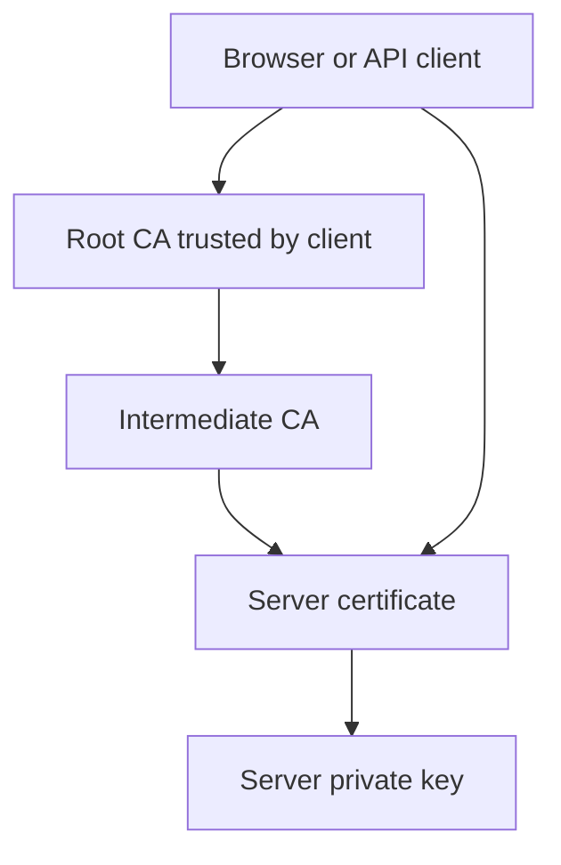
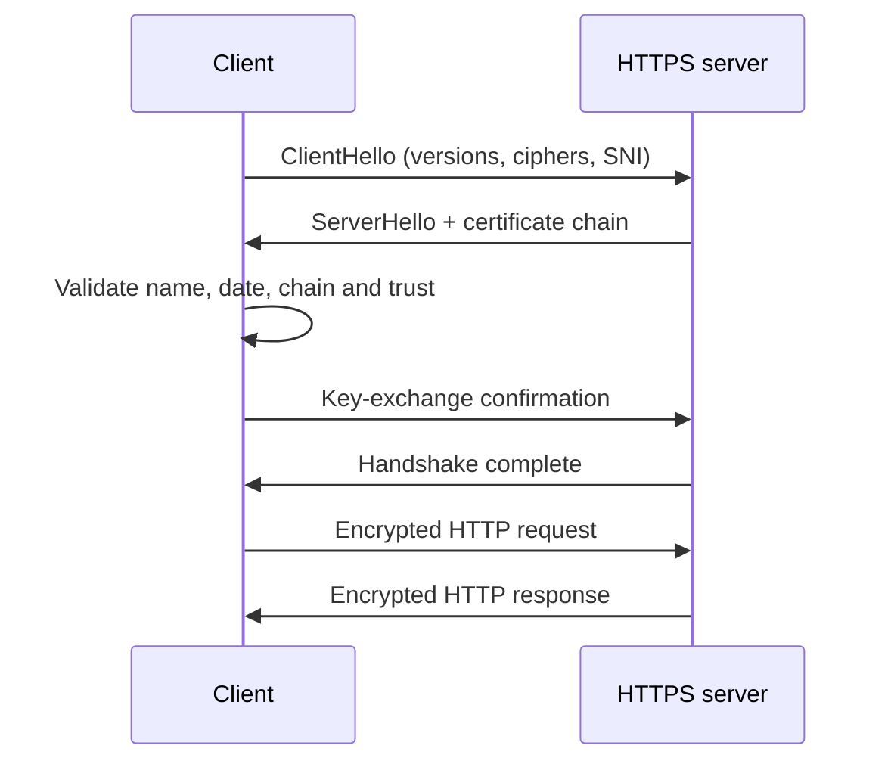
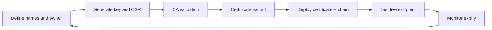
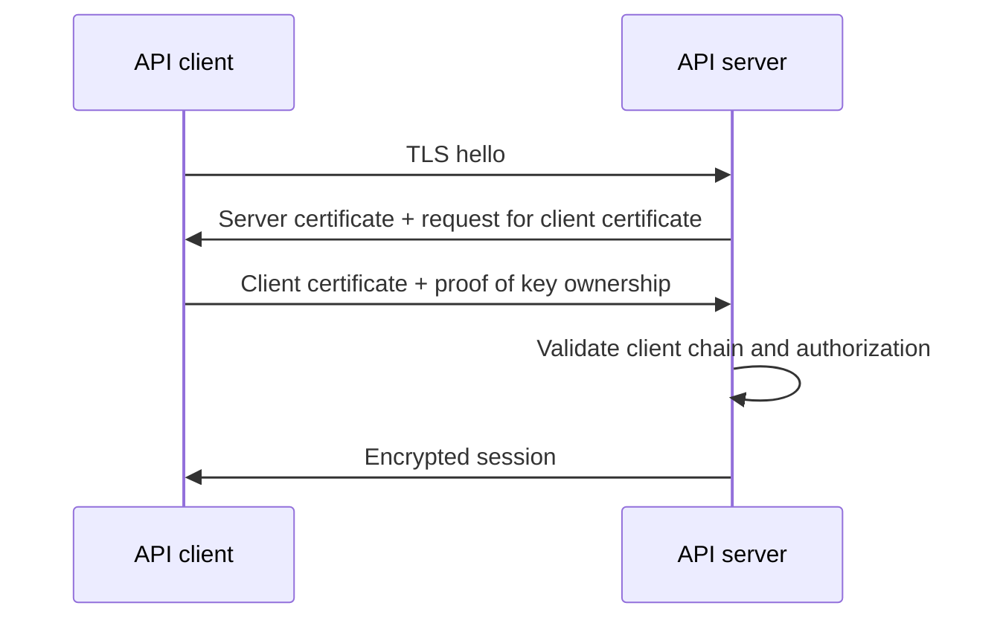

# SSL/TLS Certificates — Detailed Notes and Practical Guide

**Date:** 28-Aug-2026  
**Purpose:** Understand TLS certificates and operate HTTPS endpoints securely: request, deploy, renew, monitor, and troubleshoot.

> “SSL certificate” remains common terminology, but current secure connections use **TLS**. SSLv2/SSLv3 are obsolete.

---

## 1. What TLS certificates provide

TLS protects traffic between a client and a service.

| Property | Meaning |
|---|---|
| Encryption | Prevents network observers reading credentials, cookies, customer data, and API payloads. |
| Authentication | Confirms the client reached the intended service. |
| Integrity | Prevents traffic from being altered unnoticed in transit. |

When a user accesses `https://anl-acc.keylanehosting.com`, the browser validates the certificate, negotiates session keys, and then exchanges encrypted HTTP traffic.

## 2. PKI and the chain of trust

Public Key Infrastructure (PKI) is the system of CAs, certificates, keys, and policies used to establish trust.



| Item | Purpose | Secret? |
|---|---|---|
| Root certificate | Trust anchor distributed in OS/browser trust stores. | No |
| Intermediate certificate | Signs server/client certificates on behalf of a root CA. | No |
| Server certificate | Binds DNS identity to a public key. | No |
| Private key | Proves the server owns its certificate. | **Yes** |
| CSR | Certificate Signing Request containing public key and requested identity. | No |

The server sends its leaf certificate and intermediate certificates. Clients normally already possess the trusted root certificate.

## 3. Public/private keys

A certificate contains a public key. The matching private key stays on the server and is used to prove the server’s identity during the handshake. The connection then uses fast, temporary symmetric session keys for actual traffic encryption.

Never share a private key through email, chat, tickets, source control, or a broadly accessible share. If a key is exposed, replace the certificate and generate a new key pair.

## 4. Certificate contents

```bash
openssl x509 -in server.crt -noout -text
```

| Field | Meaning |
|---|---|
| Subject / CN | Historic identity field; retained for compatibility. |
| SAN | The authoritative list of valid DNS names/IP addresses. |
| Issuer | Certificate authority that signed it. |
| Validity | `Not Before` and `Not After` dates. |
| Public key algorithm | Usually RSA or ECDSA. |
| Key Usage / EKU | Allowed uses such as `serverAuth` and `clientAuth`. |
| Serial number | Unique certificate identifier. |
| CRL/OCSP | Revocation-status information. |

Modern clients validate **Subject Alternative Name (SAN)**. A certificate for `app.example.com` will fail for `api.example.com` unless that name is also in SAN.

## 5. Certificate types

| Type | Coverage | Typical use |
|---|---|---|
| Single-name | One DNS name | Single service endpoint |
| SAN/multi-domain | Several explicit names | Service with known hostnames |
| Wildcard | `*.example.com` | First-level subdomains; not `a.b.example.com` |
| Public CA | Public-browser trusted | Internet-facing endpoint |
| Internal CA | Enterprise-trusted | Internal apps and APIs |
| Self-signed | Own signing authority | Lab/testing only |
| Client certificate | Identifies a connecting client | Mutual TLS |

Use the narrowest certificate scope that meets the requirement. A wildcard key has a greater blast radius.

## 6. TLS handshake



- **SNI:** sends the hostname early, allowing multiple TLS vhosts/certificates on one IP.
- **Cipher suite:** algorithm set used for a connection.
- **ALPN:** selects HTTP/2 or HTTP/1.1.
- **Forward secrecy:** ephemeral key exchange protects previously captured sessions if a private key is later compromised.

Disable SSLv2, SSLv3, TLS 1.0, and TLS 1.1. Use TLS 1.2 and TLS 1.3 except for an approved legacy exception.

## 7. Certificate lifecycle



### Requirements

- DNS names required in SAN, environment, application owner, and technical contact.
- Public or enterprise CA according to the endpoint’s exposure.
- Target endpoints: RPX/load balancer, WebLogic, API gateway, etc.
- Required format: PEM, PKCS#12, or Java KeyStore.
- Renewal owner, expiry-monitoring threshold, maintenance window, and rollback owner.

### Generate and validate a CSR

```bash
openssl req -new -newkey rsa:3072 -nodes \
  -keyout portal.example.com.key \
  -out portal.example.com.csr \
  -subj "/C=NL/O=Example/CN=portal.example.com" \
  -addext "subjectAltName=DNS:portal.example.com,DNS:api.example.com"
chmod 600 portal.example.com.key

openssl req -in portal.example.com.csr -noout -text
openssl req -in portal.example.com.csr -noout -verify
```

`-nodes` creates an unencrypted private key, often needed for unattended services. It requires strict ownership, permissions, and approved secure storage.

## 8. Formats and conversion

| Format | Extension | Common use |
|---|---|---|
| PEM | `.crt`, `.pem`, `.key` | Apache/NGINX/Linux |
| DER | `.der`, `.cer` | Binary certificate tooling |
| PKCS#12 | `.p12`, `.pfx` | Windows/IIS, portable identity bundle |
| JKS | `.jks` | Java/WebLogic legacy keystore |

Create a PKCS#12 file from certificate, key, and chain:

```bash
openssl pkcs12 -export -out portal.p12 \
  -inkey portal.example.com.key -in portal.example.com.crt \
  -certfile intermediate-chain.crt -name portal
```

Import it into JKS:

```bash
keytool -importkeystore -srckeystore portal.p12 -srcstoretype PKCS12 \
  -destkeystore portal.jks -deststoretype JKS
```

Files that include a private key (`.p12`, `.pfx`, keystores) are secret material.

## 9. Deploy the full certificate chain

The usual server chain is:

```text
Leaf/server certificate
Intermediate CA certificate(s)
```

Do not normally serve the root CA. A missing intermediate causes errors such as “unable to get local issuer certificate.” Check key/certificate pairing before deployment:

```bash
openssl x509 -in portal.example.com.crt -pubkey -noout | openssl sha256
openssl pkey -in portal.example.com.key -pubout | openssl sha256
```

The two hashes must match.

## 10. Apache HTTP Server / RPX example

```apache
<VirtualHost *:443>
    ServerName portal.example.com
    ServerAlias api.example.com
    SSLEngine on
    SSLCertificateFile /etc/pki/tls/certs/portal.example.com.crt
    SSLCertificateKeyFile /etc/pki/tls/private/portal.example.com.key
    SSLCertificateChainFile /etc/pki/tls/certs/intermediate-chain.crt
    SSLProtocol -all +TLSv1.2 +TLSv1.3
    Header always set Strict-Transport-Security "max-age=31536000; includeSubDomains"
</VirtualHost>
```

Validate and reload safely:

```bash
apachectl configtest
systemctl reload httpd
```

Follow the configuration approach enforced by Puppet or other configuration management. Do not make untracked manual edits to managed vhost configuration.

## 11. Oracle WebLogic identity and trust

| Store | Contents | Purpose |
|---|---|---|
| Identity keystore | Private key, server certificate, chain | Authenticating the WebLogic server to incoming clients |
| Trust keystore | Trusted CA certificates | Validating outbound servers and mTLS clients |

High-level deployment:

1. Import the server certificate, full chain, and matching private key into the identity keystore.
2. Check the configured alias is a `PrivateKeyEntry`.
3. Back up the current keystore and configuration securely.
4. Configure the approved identity/trust paths, aliases, types, and passwords in WebLogic.
5. Restart only the required AdminServer/managed server in an approved window.
6. Test the exact external DNS name, certificate chain, and application response.

```bash
keytool -list -v -keystore identity.jks
```

An alias mismatch is a frequent cause of failed WebLogic SSL start-up or presentation of an unexpected certificate.

## 12. Mutual TLS (mTLS)

Standard HTTPS authenticates the server. mTLS authenticates both client and server.



Use mTLS for high-trust system integrations. The server must trust the client-issuing CA and map the validated identity to the minimum required authorization.

## 13. Validation and troubleshooting

Inspect the certificate presented by a live endpoint:

```bash
openssl s_client -connect portal.example.com:443 \
  -servername portal.example.com -showcerts -verify_return_error </dev/null
curl -Iv https://portal.example.com/
openssl x509 -in portal.example.com.crt -noout -dates -subject -issuer -ext subjectAltName
```

| Symptom | Likely cause | Resolution |
|---|---|---|
| Expired certificate | Renewal missed | Renew, deploy, then improve expiry monitoring. |
| Hostname mismatch | DNS name not in SAN | Reissue with correct SAN; use the intended DNS name. |
| Local issuer error | Missing/wrong intermediate chain | Deploy the full approved chain. |
| Wrong certificate returned | SNI, vhost, LB mapping problem | Test `-servername`; inspect listener/vhost mapping. |
| Key mismatch | Certificate and key are unrelated | Deploy matching pair or reissue. |
| Java `PKIX path building failed` | CA/intermediate absent from Java trust store | Import approved CA into relevant trust store. |
| Browser works, Java fails | Different trust stores/cached intermediates | Test using the actual Java runtime. |

## 14. Monitoring and renewal

Certificate expiry is predictable; it should not become an incident.

- Keep inventory: hostname, environment, owner, issuer, SANs, expiry, renewal mechanism, and dependencies.
- Monitor live TLS endpoints, not merely certificate files on disk.
- Alert at 60, 30, 14, and 7 days before expiry, subject to organizational policy.
- Monitor chain validity, hostname validation, protocol policy, handshake errors, and unexpected certificate changes.
- Assign a primary and backup renewal owner.

```bash
openssl s_client -connect portal.example.com:443 -servername portal.example.com </dev/null 2>/dev/null \
  | openssl x509 -noout -enddate
```

## 15. Renewal runbook

1. Confirm names/SANs, CA, owner, endpoints, formats, and dependent services.
2. Inspect the existing certificate, chain, key algorithm, and WebLogic/Apache alias/configuration.
3. Raise a change ticket with testing and rollback plan.
4. Generate and verify CSR, then obtain the replacement certificate and chain.
5. Validate dates, SANs, issuer, full chain, and key match offline.
6. Securely stage files with correct ownership/permissions; back up current state for rollback.
7. Deploy configuration through the approved automated/configuration-managed route.
8. Run syntax validation, then reload/restart the least disruptive component necessary.
9. Validate the live endpoint with the exact hostname/SNI and test the application.
10. Confirm monitoring sees the new expiry; update the inventory and ticket evidence.

Roll back when the service cannot present the intended certificate, TLS validation fails, or dependent integrations fail after deployment. Restore the prior known-good configuration, validate it, and test from a real client.

## 16. Security checklist

- [ ] TLS 1.2 and TLS 1.3 only; legacy protocols disabled.
- [ ] SANs cover every required DNS name.
- [ ] Full intermediate chain is served and externally verified.
- [ ] Private keys and key-containing keystores have restricted access and never enter Git/tickets/chat.
- [ ] Public endpoints use an approved public CA; internal endpoints use the approved enterprise CA.
- [ ] Named ownership, expiry monitoring, renewal process, and rollback procedure exist.
- [ ] HSTS is enabled only after confirming all applicable names are HTTPS-ready.
- [ ] mTLS identities and ACLs are scoped to the minimum required access.

## 17. DevOps toolchain mapping

| Tool/practice | Certificate-operation role |
|---|---|
| Git + pull requests | Store non-secret TLS configuration and reviewed automation; never keys/passwords. |
| Jenkins / GitHub Actions | Validate configuration, deploy approved changes, and run endpoint checks. |
| Puppet / Ansible | Enforce paths, ownership, vhost configuration, and service reloads. |
| Prometheus + Grafana | Monitor expiry, handshake validity, endpoint availability, and TLS policy. |
| ELK | Centralize Apache/WebLogic/load-balancer TLS errors. |
| Secret manager | Protect passwords, private keys, and automation credentials. |

## 18. Key takeaways

1. TLS certificates prove identity and encrypt traffic; private keys are highly sensitive.
2. SAN entries—not only CN—must cover client-facing hostnames.
3. A missing intermediate chain can break a perfectly valid certificate.
4. Verify the **live endpoint with SNI** after every change.
5. Renewal is a controlled lifecycle: inventory, test, deploy, validate, monitor, document.
6. Automate repeatable configuration and monitoring, while keeping secrets out of code and communication channels.

## 19. Suggested practice exercises

1. Inspect a permitted HTTPS endpoint using `openssl s_client` and document its issuer, SANs, chain, and expiry.
2. Generate a test CSR containing two SAN names, then inspect it before signing.
3. Build a local Apache/NGINX test vhost with a private CA and test correct/incorrect chains.
4. Configure an expiry alert for a test certificate at 30 days.
5. Write a renewal and rollback plan for one non-production RPX or WebLogic endpoint.

